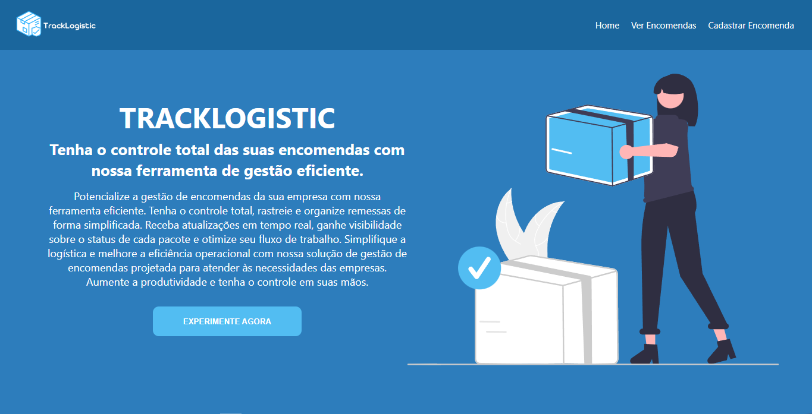
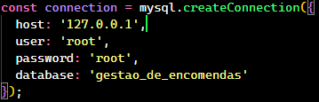
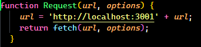

# ***TRACKLOGISTIC***

Tracklogistic é um Gestor de Encomendas desenvolvido com intuito de colocar em prática os conhecimentos adquiridos ao longo do curso de Javascript ministrado pelo Professor [Augusto Monteiro](https://github.com/augustnmonteiro).

## **Súmario**
* [Instalação](#secao1)
* [Como Usar](#secao2)
* [Tecnologias Utilizadas](#secao3)
* [Autores](#secao4)
* [Agradecimentos](#secao5)

## **Instalação**
Para clonar e executar este aplicativo, você precisará do [Git](https://git-scm.com) e do [Node.js](https://nodejs.org/en/) instalados em sua máquina. Em seguida,
* Clone o repositório
    * no terminal, execute o comando : 
        > `git clone https://github.com/augustnmonteiro/gestor-de-encomendas.git`
* Instale as dependências na pasta raíz `backend` e `frontend` com o comando :
    > `npm install`
* Faça o Download do BD para a sua máquina local
    * O arquivo está na raíz do projeto :
        > gestao_de_encomendas.sql

**Para alterar as configurações do BD caso necessário, siga o passo a passo**

*Acesse o arquivo `main.js`*
* backend 
    * main.js
        > 

*Altere os dados necessários para utilizá-lo em sua máquina.* 

**Caso seja necessário alterar a URL local para rodar o servidor, acesse o arquivo `utilities.js`.**

* frontend
    * src
        * utilities.js
            > 

*Altere os dados necessários para utiliza-lo em sua máquina.*

## **Como Usar**
Depois de ter concluído toda a configuração inicial. Siga o passo a passo a seguir :

1. Abra o terminal na pasta "backend/src". 
* backend
    * src
        * main.js

2. Execute o arquivo `main.js` com o comando :
    > `node main.js`

    *O servidor do backend será inicializado.*

3. **Em seguida, abra outro terminal na pasta "frontend" e execute o comando :**
    > `npm start`

    *O servidor do frontend será inicializado.*

***Com os 2 servidores incializados, a aplicação está pronta para ser utilizada.***

## **Tecnologias Utilizadas**

- [Node.js](https://nodejs.org/en/)
- [Express](https://expressjs.com/)
- [Javascript](https://developer.mozilla.org/pt-BR/docs/Web/JavaScript)
- [ReactJS](https://react.dev/)
- [CSS](https://developer.mozilla.org/pt-BR/docs/Web/CSS)

## **Lista de Autores do Projeto:**
* David Freitas [@davidfreitas0](https://github.com/DavidFreitas0)
* Hugo Silva [@hugo.silva777](https://github.com/hugo3az)
* Luiz Roberto [Luiz-Honorato](https://github.com/Luiz-Honorato)
* Ivina karol [@ivinakarol](https://github.com/ivinakarol)
* Vanessa Rodrigues [@vanessarlrodrigues](https://github.com/vanessarlrodrigues)
* Valderlanio Junior [@valderlanioj](https://github.com/ValderlanioJ)

***Projeto Orientado por : [Augusto Monteiro](https://github.com/augustnmonteiro)***

## **Agradecimentos**

Em nome de todos os alunos que estiveram presentes em todas as aulas durante esses 4 meses de curso, gostaríamos de **agradecer imensamente** ao nosso Professor [Augusto Monteiro](https://github.com/augustnmonteiro) pela **oportunidade** e por toda **dedicação, esforço, paciência e aprendizado** passado a todos nós. Foi um período de muita evolução e que sem nenhuma dúvida mudou nossas vidas.